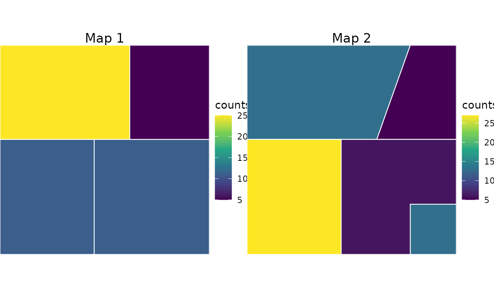
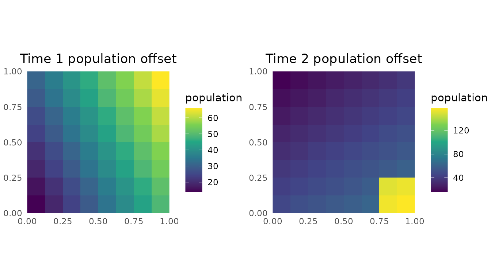
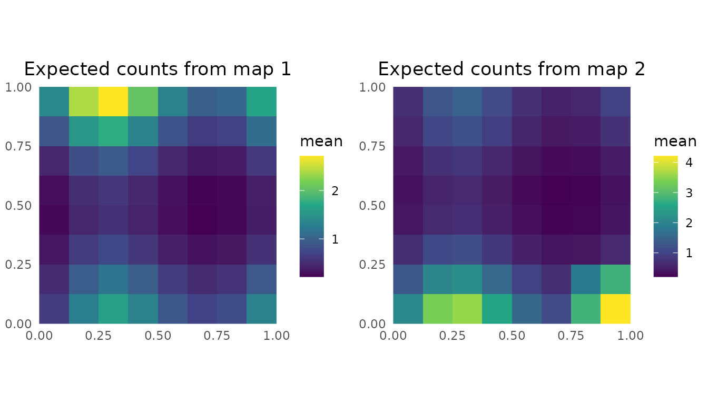

# Disaggregation With Multiple Maps

This vignette builds a small synthetic example for the multiple-map
setting. Two sets of administrative regions cover the same unit-square
domain, but the boundaries differ. We simulate time-varying fine-scale
population offsets and counts, aggregate those counts to each map, and
then use `DAST` to infer a fine-scale risk surface from the two areal
observations.

``` r

library(DAST)
library(ggplot2)
library(sf)
library(terra)

sf::sf_use_s2(FALSE)
```

## Construct schematic maps

The two maps below reuse the geometry from the schematic figure. Map 1
has four rectangular regions. Map 2 redraws the boundaries into five
regions.

``` r

make_rect <- function(xmin, ymin, xmax, ymax) {
  st_polygon(list(matrix(
    c(
      xmin, ymin,
      xmax, ymin,
      xmax, ymax,
      xmin, ymax,
      xmin, ymin
    ),
    ncol = 2,
    byrow = TRUE
  )))
}

make_poly <- function(coords) {
  st_polygon(list(rbind(coords, coords[1, ])))
}

make_sf <- function(ids, geometries) {
  st_sf(
    area_id = ids,
    geometry = st_sfc(geometries, crs = 3857)
  )
}

map_1 <- make_sf(
  ids = paste0("S1", 1:4),
  geometries = list(
    make_rect(0.00, 0.00, 0.45, 0.55),
    make_rect(0.45, 0.00, 1.00, 0.55),
    make_rect(0.00, 0.55, 0.62, 1.00),
    make_rect(0.62, 0.55, 1.00, 1.00)
  )
)

map_2 <- make_sf(
  ids = paste0("S2", 1:5),
  geometries = list(
    make_poly(matrix(
      c(
        0.00, 0.55,
        0.62, 0.55,
        0.78, 1.00,
        0.00, 1.00
      ),
      ncol = 2,
      byrow = TRUE
    )),
    make_poly(matrix(
      c(
        0.62, 0.55,
        1.00, 0.55,
        1.00, 1.00,
        0.78, 1.00
      ),
      ncol = 2,
      byrow = TRUE
    )),
    make_poly(matrix(
      c(
        0.45, 0.00,
        0.45, 0.55,
        0.00, 0.55,
        0.00, 0.00
      ),
      ncol = 2,
      byrow = TRUE
    )),
    make_poly(matrix(
      c(
        0.45, 0.00,
        0.78, 0.00,
        0.78, 0.24,
        1.00, 0.24,
        1.00, 0.55,
        0.45, 0.55
      ),
      ncol = 2,
      byrow = TRUE
    )),
    make_poly(matrix(
      c(
        0.78, 0.00,
        1.00, 0.00,
        1.00, 0.24,
        0.78, 0.24
      ),
      ncol = 2,
      byrow = TRUE
    ))
  )
)
```

## Simulate populations and counts

The aggregation rasters are simulated population offsets. The second
time point has a higher-density pocket in the bottom-right polygon
introduced by the second map. Counts are simulated on the same fine grid
from a negative-binomial model, then summed into each polygon support.

``` r

set.seed(1)

template <- rast(
  ncol = 8,
  nrow = 8,
  xmin = 0,
  xmax = 1,
  ymin = 0,
  ymax = 1,
  crs = "EPSG:3857"
)
xy <- xyFromCell(template, seq_len(ncell(template)))

population_1 <- template
values(population_1) <- pmax(1, round(10 + 40 * xy[, 1] + 20 * xy[, 2]))
names(population_1) <- "population"

bottom_right_hotspot <- xy[, 1] >= 0.78 & xy[, 2] <= 0.24

population_2 <- template
values(population_2) <- pmax(
  1,
  round(12 + 25 * xy[, 1] + 35 * (1 - xy[, 2]) + 90 * bottom_right_hotspot)
)
names(population_2) <- "population"

risk <- template
values(risk) <- as.numeric(scale(
  sin(2 * pi * xy[, 1]) + cos(2 * pi * xy[, 2])
))
names(risk) <- "risk"

mean_counts_1 <- values(population_1) * exp(-4 + 0.8 * values(risk))
mean_counts_2 <- values(population_2) * exp(-4 + 0.8 * values(risk))

fine_counts_1 <- template
values(fine_counts_1) <- rnbinom(ncell(template), size = 8, mu = mean_counts_1)
names(fine_counts_1) <- "counts"

fine_counts_2 <- template
values(fine_counts_2) <- rnbinom(ncell(template), size = 8, mu = mean_counts_2)
names(fine_counts_2) <- "counts"

map_1$response <- as.integer(
  extract(fine_counts_1, vect(map_1), fun = sum, na.rm = TRUE)[[2]]
)
map_2$response <- as.integer(
  extract(fine_counts_2, vect(map_2), fun = sum, na.rm = TRUE)[[2]]
)
```

``` r

plot_polygon_counts <- function(x, title) {
  ggplot(x) +
    geom_sf(aes(fill = response), color = "white", linewidth = 0.4) +
    scale_fill_viridis_c(name = "counts") +
    coord_sf(expand = FALSE) +
    labs(title = title) +
    theme_void() +
    theme(
      legend.position = "right",
      plot.title = element_text(hjust = 0.5)
    )
}

cowplot::plot_grid(
  plot_polygon_counts(map_1, "Map 1"),
  plot_polygon_counts(map_2, "Map 2"),
  nrow = 1
)
```



``` r

plot_raster <- function(x, title, fill = names(x)[1]) {
  df <- as.data.frame(x, xy = TRUE, na.rm = FALSE)
  names(df)[3] <- "value"

  ggplot(df, aes(x = x, y = y, fill = value)) +
    geom_raster() +
    scale_fill_viridis_c(name = fill) +
    coord_equal(expand = FALSE) +
    labs(title = title, x = NULL, y = NULL) +
    theme_minimal() +
    theme(plot.title = element_text(hjust = 0.5))
}

cowplot::plot_grid(
  plot_raster(population_1, "Time 1 population offset", "population"),
  plot_raster(population_2, "Time 2 population offset", "population"),
  nrow = 1
)
```



## Prepare and fit the model

The package workflow starts by combining the areal responses, covariate
raster, and aggregation raster into a `disag_data_mmap` object.

``` r

schematic_data <- prepare_data_mmap(
  polygon_shapefile_list = list(map_1, map_2),
  covariate_rasters_list = list(risk, risk),
  aggregation_rasters_list = list(population_1, population_2),
  mesh_args = list(max.edge = c(0.5, 1), cutoff = 0.1)
)

schematic_data
#> Disaggregation data (multi-map) info
#> =====================================
#> Time points: 2
#> Total polygons: 9
#> Total pixels: 128
#> 
#> Use `summary(...)` for more details.
```

We fit a small negative-binomial model with AGHQ. The example keeps the
mesh coarse and uses one quadrature point so the vignette remains
lightweight.

``` r

fit <- disag_model_mmap(
  schematic_data,
  engine = "AGHQ",
  family = "negbinomial",
  link = "log",
  field = TRUE,
  iid = FALSE,
  engine.args = list(aghq_k = 1, optimizer = "nlminb"),
  silent = TRUE
)

fit
#> Disaggregation model (multi-map) fit with AGHQ
#> ==============================================
#> Family: negbinomial
#> Link function: log
#> Spatial field included: Yes
#> IID effects included: No
#> Betas as fixed effects: Yes
#> Quadrature Points: 1
#> 
#> Fixed effects parameters: 6
#> Parameter names:  intercept, slope, log_sigma, log_rho, mode, H 
#> 
#> Random effects: 1
#>   IID effects: 1
#> 
#> Use `summary(...)` for more detailed information about the model fit.
```

## Predict on the fine grid

The model prediction contains one fine-scale rate raster for each
map/time point. Because the population offset enters the aggregation
likelihood, not the returned rate surface, we multiply each rate raster
by the matching population raster to visualize expected fine-cell
counts.

``` r

pred <- predict(fit, N = 10)
pred
#> $mean_prediction
#> $mean_prediction$prediction
#> $mean_prediction$prediction$time_1
#> class       : SpatRaster
#> size        : 8, 8, 1  (nrow, ncol, nlyr)
#> resolution  : 0.125, 0.125  (x, y)
#> extent      : 0, 1, 0, 1  (xmin, xmax, ymin, ymax)
#> coord. ref. : 
#> source(s)   : memory
#> name        :        y
#> min value   : 0.004663
#> max value   : 0.067214
#> 
#> $mean_prediction$prediction$time_2
#> class       : SpatRaster
#> size        : 8, 8, 1  (nrow, ncol, nlyr)
#> resolution  : 0.125, 0.125  (x, y)
#> extent      : 0, 1, 0, 1  (xmin, xmax, ymin, ymax)
#> coord. ref. : 
#> source(s)   : memory
#> name        :        y
#> min value   : 0.004663
#> max value   : 0.067214
#> 
#> 
#> $mean_prediction$field
#> $mean_prediction$field$time_1
#> class       : SpatRaster
#> size        : 8, 8, 1  (nrow, ncol, nlyr)
#> resolution  : 0.125, 0.125  (x, y)
#> extent      : 0, 1, 0, 1  (xmin, xmax, ymin, ymax)
#> coord. ref. : 
#> source(s)   : memory
#> name        :         y
#> min value   : -0.026119
#> max value   :  0.025359
#> 
#> $mean_prediction$field$time_2
#> class       : SpatRaster
#> size        : 8, 8, 1  (nrow, ncol, nlyr)
#> resolution  : 0.125, 0.125  (x, y)
#> extent      : 0, 1, 0, 1  (xmin, xmax, ymin, ymax)
#> coord. ref. : 
#> source(s)   : memory
#> name        :         y
#> min value   : -0.026119
#> max value   :  0.025359
#> 
#> 
#> $mean_prediction$iid
#> NULL
#> 
#> $mean_prediction$covariates
#> $mean_prediction$covariates$time_1
#> class       : SpatRaster
#> size        : 8, 8, 1  (nrow, ncol, nlyr)
#> resolution  : 0.125, 0.125  (x, y)
#> extent      : 0, 1, 0, 1  (xmin, xmax, ymin, ymax)
#> coord. ref. : 
#> source(s)   : memory
#> name        :         y
#> min value   : -5.361895
#> max value   : -2.713278
#> 
#> $mean_prediction$covariates$time_2
#> class       : SpatRaster
#> size        : 8, 8, 1  (nrow, ncol, nlyr)
#> resolution  : 0.125, 0.125  (x, y)
#> extent      : 0, 1, 0, 1  (xmin, xmax, ymin, ymax)
#> coord. ref. : 
#> source(s)   : memory
#> name        :         y
#> min value   : -5.361895
#> max value   : -2.713278
#> 
#> 
#> 
#> $uncertainty_prediction
#> $uncertainty_prediction$realisations
#> NULL
#> 
#> $uncertainty_prediction$predictions_ci
#> $uncertainty_prediction$predictions_ci$lower
#> $uncertainty_prediction$predictions_ci$lower$time_1
#> class       : SpatRaster
#> size        : 8, 8, 1  (nrow, ncol, nlyr)
#> resolution  : 0.125, 0.125  (x, y)
#> extent      : 0, 1, 0, 1  (xmin, xmax, ymin, ymax)
#> coord. ref. : 
#> source(s)   : memory
#> name        :        y
#> min value   : 0.004663
#> max value   : 0.067214
#> 
#> $uncertainty_prediction$predictions_ci$lower$time_2
#> class       : SpatRaster
#> size        : 8, 8, 1  (nrow, ncol, nlyr)
#> resolution  : 0.125, 0.125  (x, y)
#> extent      : 0, 1, 0, 1  (xmin, xmax, ymin, ymax)
#> coord. ref. : 
#> source(s)   : memory
#> name        :        y
#> min value   : 0.004663
#> max value   : 0.067214
#> 
#> 
#> $uncertainty_prediction$predictions_ci$upper
#> $uncertainty_prediction$predictions_ci$upper$time_1
#> class       : SpatRaster
#> size        : 8, 8, 1  (nrow, ncol, nlyr)
#> resolution  : 0.125, 0.125  (x, y)
#> extent      : 0, 1, 0, 1  (xmin, xmax, ymin, ymax)
#> coord. ref. : 
#> source(s)   : memory
#> name        :        y
#> min value   : 0.004663
#> max value   : 0.067214
#> 
#> $uncertainty_prediction$predictions_ci$upper$time_2
#> class       : SpatRaster
#> size        : 8, 8, 1  (nrow, ncol, nlyr)
#> resolution  : 0.125, 0.125  (x, y)
#> extent      : 0, 1, 0, 1  (xmin, xmax, ymin, ymax)
#> coord. ref. : 
#> source(s)   : memory
#> name        :        y
#> min value   : 0.004663
#> max value   : 0.067214
#> 
#> 
#> 
#> 
#> attr(,"class")
#> [1] "disag_prediction_mmap_aghq" "list"
```

``` r

prediction_rasters <- pred$mean_prediction$prediction

expected_counts_1 <- prediction_rasters[["time_1"]] * population_1
expected_counts_2 <- prediction_rasters[["time_2"]] * population_2

cowplot::plot_grid(
  plot_raster(expected_counts_1, "Expected counts from map 1", "mean"),
  plot_raster(expected_counts_2, "Expected counts from map 2", "mean"),
  nrow = 1
)
```



This toy example is intentionally small, but it shows the main contract:
multiple areal maps, a population offset raster, optional covariates,
model fitting, and fine-grid prediction all pass through the same
multi-map interface.
